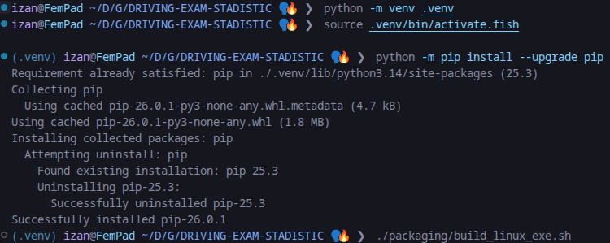
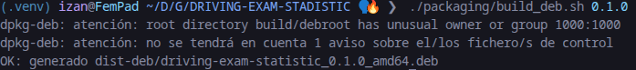
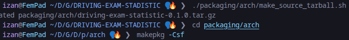
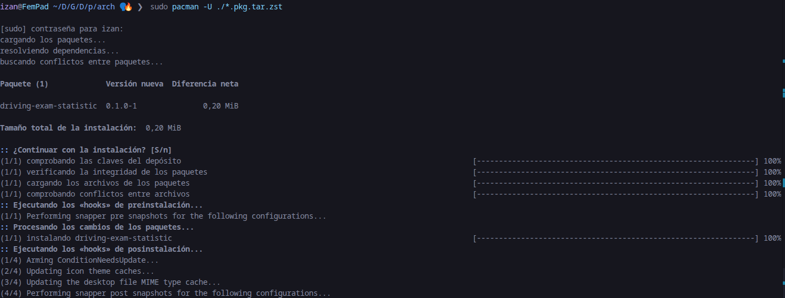
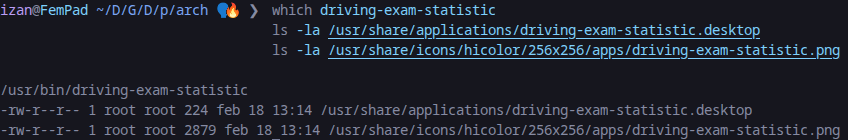
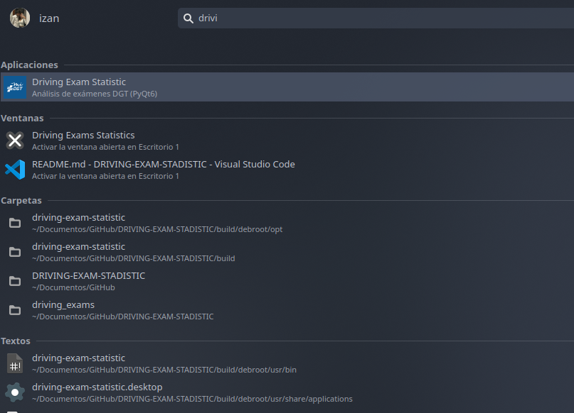
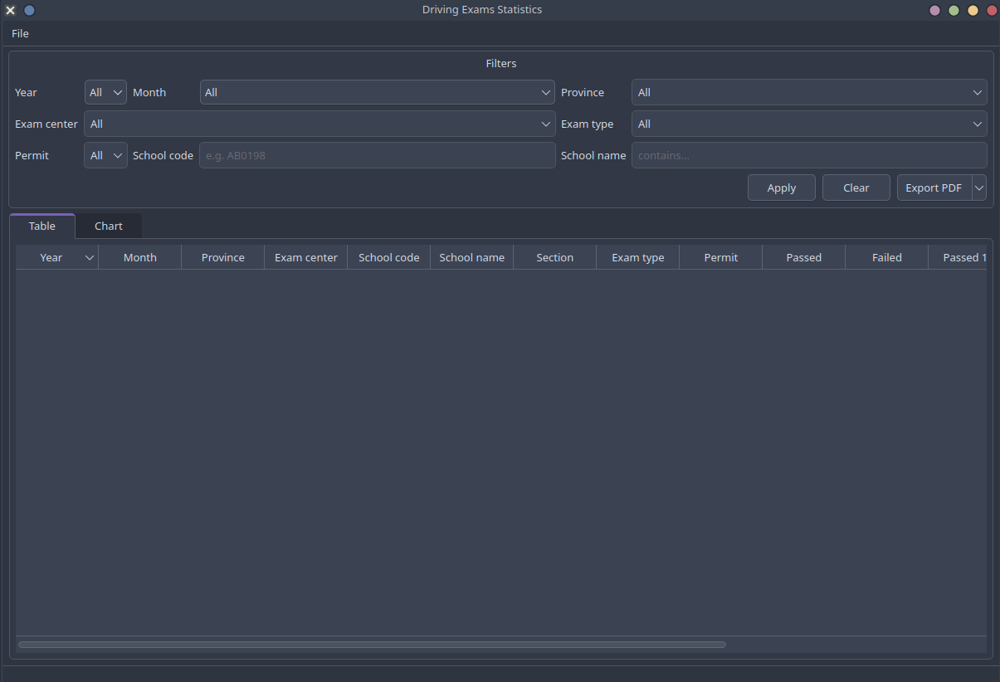
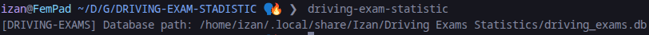
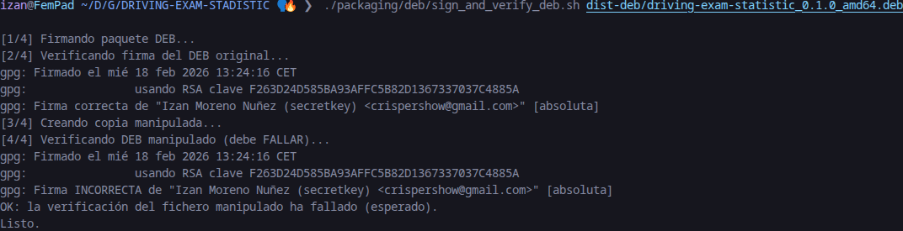

# DRIVING-EXAM-STADISTIC

Aplicación de escritorio en **PyQt6** para importar, almacenar, filtrar y analizar resultados de exámenes de conducir de la DGT (autoescuelas).

Fuente de datos:
https://www.dgt.es/menusecundario/dgt-en-cifras/matraba-listados/conductores-autoescuelas.html

## Instalación básica

1) Crear entorno virtual e instalar dependencias:

```bash
python -m venv .venv
source .venv/bin/activate
pip install -r requirements.txt
```

2) Ejecutar la aplicación:

```bash
python -m driving_exams
```

## Instalación editable (`pip install -e .`)

```bash
python -m venv .venv
source .venv/bin/activate
pip install -e .
driving-exam-statistic
```

## Build y empaquetado Linux (EndeavourOS/Arch + DEB)

El icono del lanzador se toma de:

- `driving_exams/ui/icon/icon.png`

### 1) Ejecutable Linux (PyInstaller)

```bash
python -m venv .venv
source .venv/bin/activate.fish   # en fish
./packaging/build_linux_exe.sh
```

Salida:

- `dist/driving-exam-statistic`

### 2) Paquete DEB

```bash
./packaging/build_deb.sh 0.1.0
```

Salida:

- `dist-deb/driving-exam-statistic_0.1.0_amd64.deb`

### 3) Paquete Arch/EndeavourOS (`.pkg.tar.zst`)

```bash
./packaging/arch/make_source_tarball.sh
cd packaging/arch
makepkg -Csf
sudo pacman -U ./*.pkg.tar.zst
```

Salida (ejemplo):

- `packaging/arch/driving-exam-statistic-0.1.0-1-any.pkg.tar.zst`

Tras instalar con `pacman -U`, el ejecutable queda en:

- `/usr/bin/driving-exam-statistic`

Archivos del lanzador de menú:

- `/usr/share/applications/driving-exam-statistic.desktop`
- `/usr/share/icons/hicolor/256x256/apps/driving-exam-statistic.png`

## Proceso para el informe (capturas y evidencias)

Esta sección cubre exactamente lo que pide la práctica para Linux.

### A) Proceso de creación de ejecutable e instaladores

Comandos ejecutados:

```bash
./packaging/build_linux_exe.sh
./packaging/build_deb.sh 0.1.0
./packaging/arch/make_source_tarball.sh
cd packaging/arch
makepkg -Csf
sudo pacman -U ./*.pkg.tar.zst
```

Capturas:






### B) Capturas de funcionamiento e icono del lanzador

Comprobación en terminal:

```bash
which driving-exam-statistic
ls -la /usr/share/applications/driving-exam-statistic.desktop
ls -la /usr/share/icons/hicolor/256x256/apps/driving-exam-statistic.png
```

Capturas:





### C) Demostración de `QStandardPaths` y BD en carpeta de usuario

La app usa `QStandardPaths.AppDataLocation` para crear la base de datos en la carpeta de datos del usuario.

Ejecuta:

```bash
driving-exam-statistic
```

Salida esperada (ejemplo):

```text
[DRIVING-EXAMS] Database path: /home/usuario/.local/share/Izan/Driving Exams Statistics/driving_exams.db
```

Comprobación:

```bash
find ~/.local/share/Izan -name "driving_exams.db"
```

Captura:



### D) Firma y verificación del paquete DEB + manipulación

Comando ejecutado:

```bash
./packaging/deb/sign_and_verify_deb.sh dist-deb/driving-exam-statistic_0.1.0_amd64.deb
```

La firma se realizó con la clave GPG:

- `F263D24D585BA93AFFC5B82D1367337037C4885A`

Resultado real obtenido:

```text
[1/4] Firmando paquete DEB...
[2/4] Verificando firma del DEB original...
gpg: Firmado el mié 18 feb 2026 13:24:16 CET
gpg:                usando RSA clave F263D24D585BA93AFFC5B82D1367337037C4885A
gpg: Firma correcta de "Izan Moreno Nuñez (secretkey) <crispershow@gmail.com>" [absoluta]
[3/4] Creando copia manipulada...
[4/4] Verificando DEB manipulado (debe FALLAR)...
gpg: Firmado el mié 18 feb 2026 13:24:16 CET
gpg:                usando RSA clave F263D24D585BA93AFFC5B82D1367337037C4885A
gpg: Firma INCORRECTA de "Izan Moreno Nuñez (secretkey) <crispershow@gmail.com>" [absoluta]
OK: la verificación del fichero manipulado ha fallado (esperado).
Listo.
```

Captura:



Ficheros generados:

- `dist-deb/driving-exam-statistic_0.1.0_amd64.deb.sig`
- `dist-deb/driving-exam-statistic_0.1.0_amd64.deb.tampered`

## Importación de datos

Descarga el fichero mensual TXT/CSV de la DGT (separado por `;`) e impórtalo desde el menú:

- `File -> Import CSV...`
